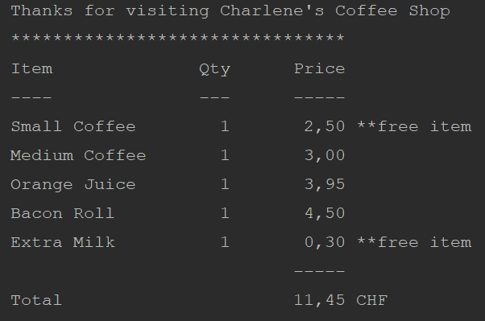

# Charlene's Coffee Corner

This project runs on Java 8 and needs a Maven installation.
* To get Java 11 go to [Java Oracle](https://www.oracle.com/java/technologies/javase-jdk11-downloads.html) 
* For downloading and installing Maven you can go to [Apache Maven web](https://maven.apache.org/download.cgi).

# Run app
To run the application and see an example of a ticket run com.assignment.Application. It should look like:

In order to run all the tests you can use maven phase test `mvn test` from any terminal. Also, from you favourite IDE,
for example if you use IntelliJ right click on \src\test\java and select "Run 'All tests' "

# Use cases

1. A new client orders a small coffee, he/her gets a receipt for 2.50 CHF, and a stamp card with one stamp. 
1. A new client orders a medium coffee, he/her gets a receipt for 3 CHF, and a stamp card with one stamp. 
1. A new client orders a large coffee, he/her gets a receipt for 3.50 CHF, and a stamp card with one stamp. 
   
1. A new client orders a small coffee with a bacon roll, he/her gets a receipt for 7 CHF, and a stamp card with one stamp. 
1. A new client orders a medium coffee with a bacon roll, he/her gets a receipt for 7.50 CHF, and a stamp card with one stamp. 
1. A new client orders a large coffee with a bacon roll, he/her gets a receipt for 8 CHF, and a stamp card with one stamp. 
   
1. A new client orders a small coffee with an orange juice, he/her gets a receipt for 6.45 CHF, and a stamp card with one stamp. 
1. A new client orders a medium coffee with an orange juice, he/her gets a receipt for 6.95 CHF, and a stamp card with one stamp. 
1. A new client orders a large coffee with an orange juice, he/her gets a receipt for 7.45 CHF, and a stamp card with one stamp. 

1. A new client orders a small coffee with a bacon roll and an orange juice, he/her gets a receipt for 10.95 CHF,
   and a stamp card with one stamp.
   ... rest of cases

1. A new client orders a small coffee with extra milk, a bacon roll and an orange juice, he/her gets a receipt for 10.95 CHF,
   and a stamp card with one stamp. (Free extra)
   ... other cases with other extras
   
1. A returning client orders a small coffee with extra milk, a bacon roll and an orange juice. He has a stamp card
with 4 stamps. He gets a receipt for 8.45 CHF. (Free extra + free beverage)
1. A returning client orders a medium coffee, a small coffee with extra milk, a bacon roll and an orange juice. He has a stamp card
with 4 stamps. He gets a receipt for 11.45 CHF. (Free extra + free beverage)
   ... other cases with free beverage